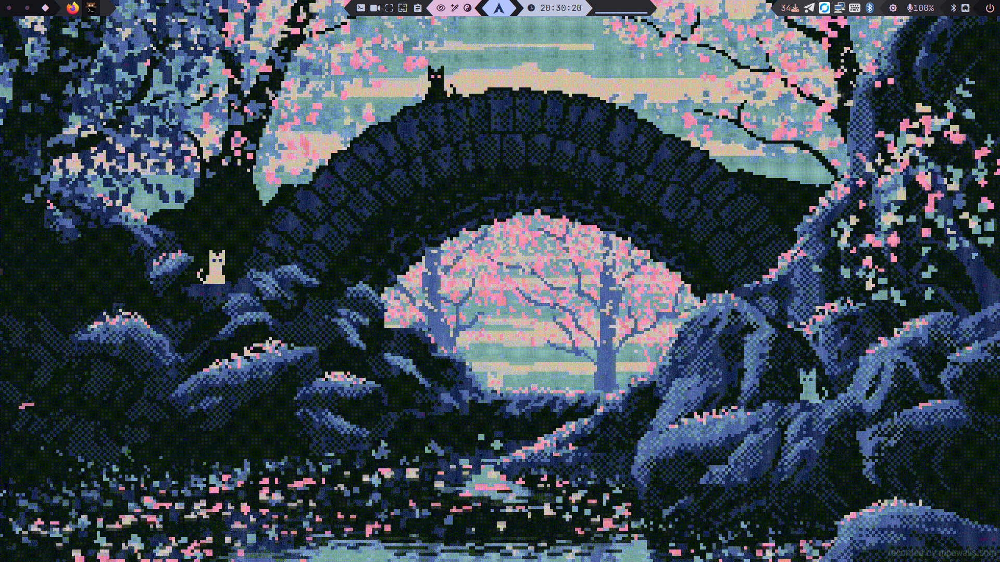
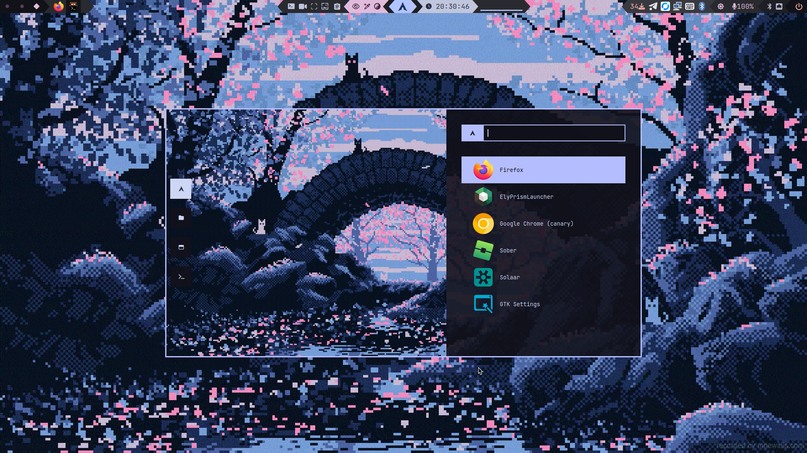
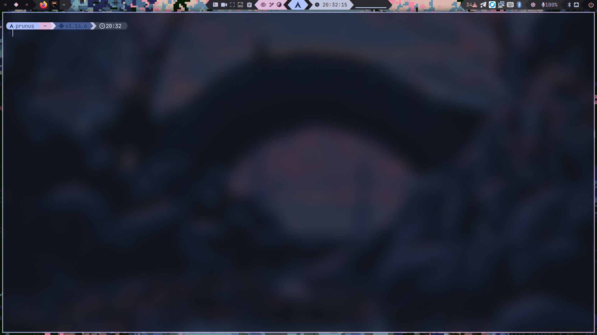
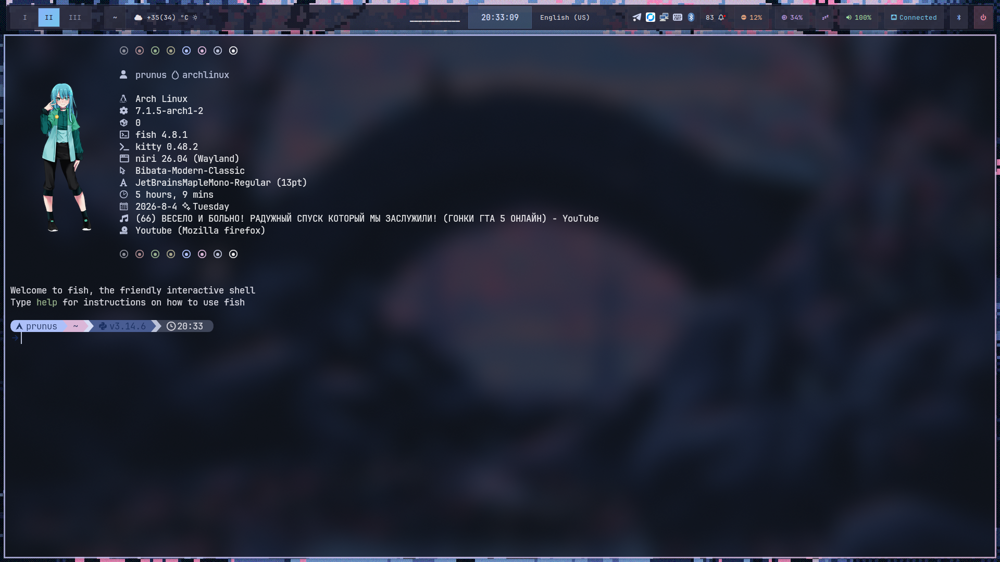
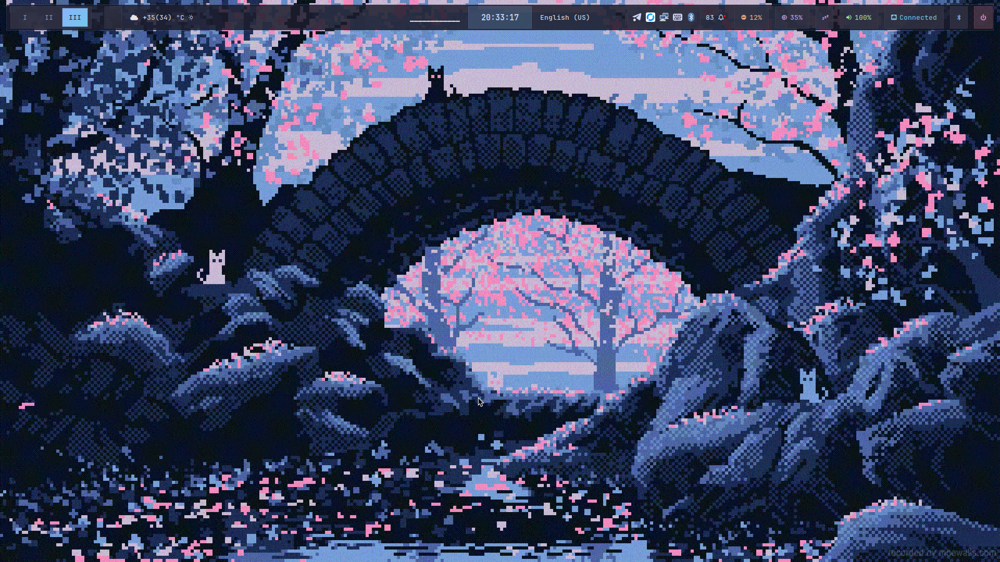
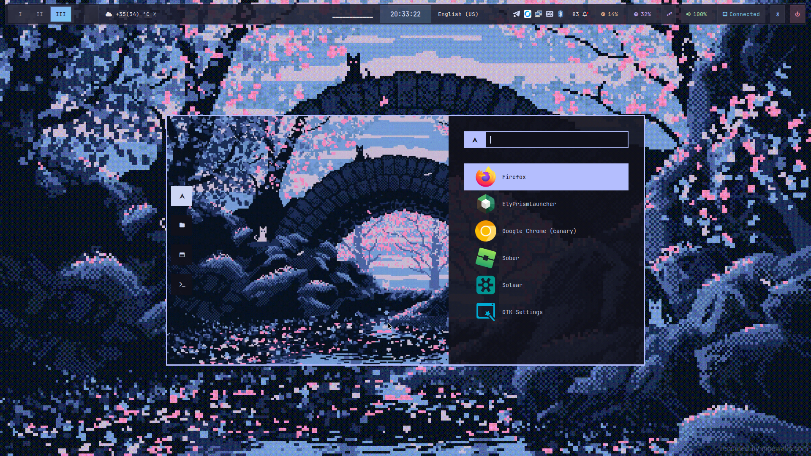

# 🌌 prunus' Dotfiles


Welcome to my dotfiles repository! This is a collection of my personal configuration files for an **Arch Linux** environment powered by the **Niri** and **Hyprland** tiling compositors.

The repository uses a **flat GNU Stow structure**: configuration files live right in the root of each package directory, and are deployed with `stow -t <target>` (no redundant `.config/program/` nesting inside the repo).

---

## 🖼️ Screenshots

### Variant 1 — current (niri + matugen, waybar)

| | | |
|---|---|---|
|  |  |  |

### Variant 2 — legacy (older style)

| | | |
|---|---|---|
|  |  |  |

---

## ✨ Features

- **Niri & Hyprland** configs — both compositors supported
- **fish** shell with two styles (current / legacy), switchable via script
- **waybar** with two styles (current matugen / legacy), switchable via script
- **kitty** with matugen dynamic theming
- **GTK / Qt theming**: gtk-3.0, gtk-4.0, Kvantum, qt5ct, qt6ct
- **Wallpapers** maintained in a separate repository: [DotFiles-Walls](https://github.com/prunusmalus/DotFiles-Walls)

---

## 📂 Repository Structure

Each folder is an independent configuration package:

- **Compositors / WM:** `niri`, `hypr`, `bspwm`, `driftwm`, `quickshell`
- **Terminal & Shell:** `kitty`, `fish`
- **Bars & Notifications:** `waybar`, `swaync`
- **Menus & Launchers:** `rofi`, `niripwmenu`, `wlogout`
- **Look & Feel / Themes:** `gtk-3.0`, `gtk-4.0`, `gtk-themes`, `Kvantum`, `qt5ct`, `qt6ct`, `nwg-look`
- **Utilities & Media:** `nvim` (Text editor), `yazi` (File manager), `cava` (Audio visualizer), `clipcat`
- **Themed Apps:** `BetterDiscord`, `spicetify` (Spotify), `zen` (Browser)

---

## 🚀 Quick Start

```bash
git clone https://github.com/prunusmalus/DotFiles.git ~/DotFiles
cd ~/DotFiles
./script.sh
```

`script.sh` will:

1. Install dependencies (via `install-deps.sh`, with Flatpak fallback for GUI apps)
2. Deploy the dotfiles with GNU Stow — **safely**: conflicting files are backed up to `~/.dotfiles-backup-<date>` instead of being deleted
3. Let you choose the fish and waybar styles

You can also run only a specific step:

```bash
./script.sh --deps     # dependencies only
./script.sh --deploy   # deploy dotfiles only
./script.sh --styles   # choose fish / waybar style only
```

---

## 🛠️ Manual Installation (GNU Stow)

The standard `stow */` must **not** be used — it would link files directly into your home directory root. Instead, each package is deployed to its specific target:

```bash
# example: deploy niri config
stow --no-folding -t ~/.config/niri niri
```

If you get a conflict (a real file already exists where a symlink should go), move it aside first or let `script.sh --deploy` handle it automatically.

### Switching styles

```bash
./choose-style.sh            # interactive menu
./choose-style.sh fish       # switch fish style
./choose-style.sh waybar     # switch waybar style
```

---

## 🖼️ Wallpapers

Wallpapers live in a separate repository to keep this one light:

- **Repo:** [DotFiles-Walls](https://github.com/prunusmalus/DotFiles-Walls)
- Clone with: `git clone https://github.com/prunusmalus/DotFiles-Walls.git ~/DotFiles-Walls`

---

## 📄 License

See [LICENSE](LICENSE).
